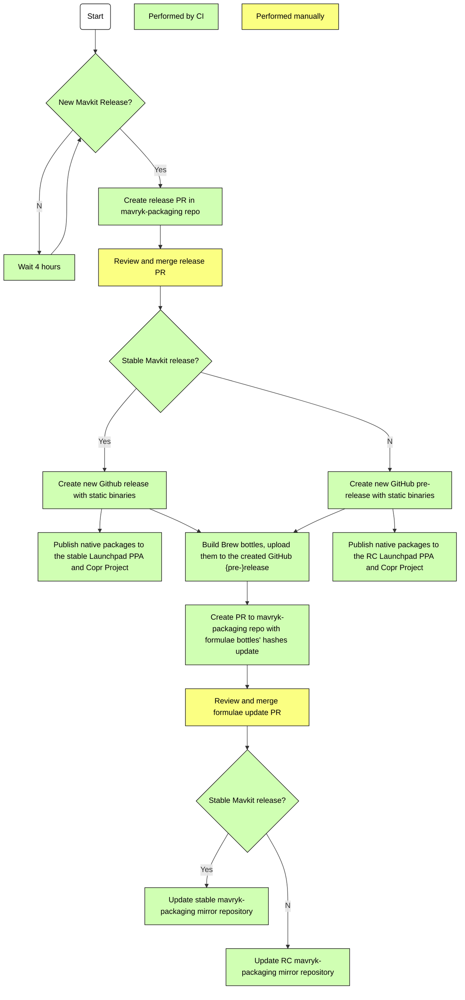

<!--
   - SPDX-FileCopyrightText: 2022 Oxhead Alpha
   - SPDX-License-Identifier: LicenseRef-MIT-OA
   -->
# Release workflow

This document explains the steps and timings of the release process in `mavryk-packaging`.

The releasing process is almost fully automated, with the initial release PR being created
at most 4 hours after a new Mavkit release. The only steps that require manual intervention
are reviews of this initial PR and of the PR that updates macOS brew formulae.
This allows `mavryk-packaging` to closely follow Mavkit releases without large waiting times.

This process can be described by the following diagram:

